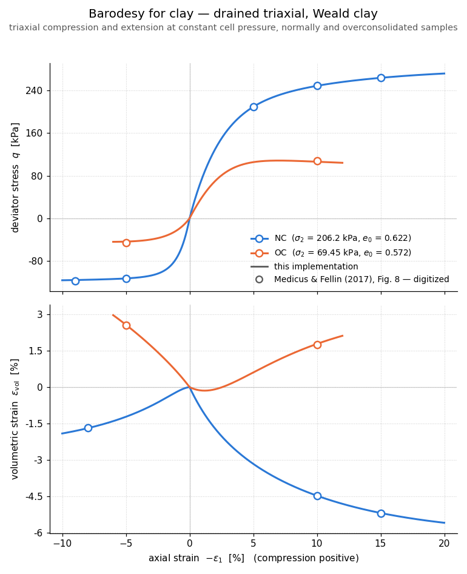
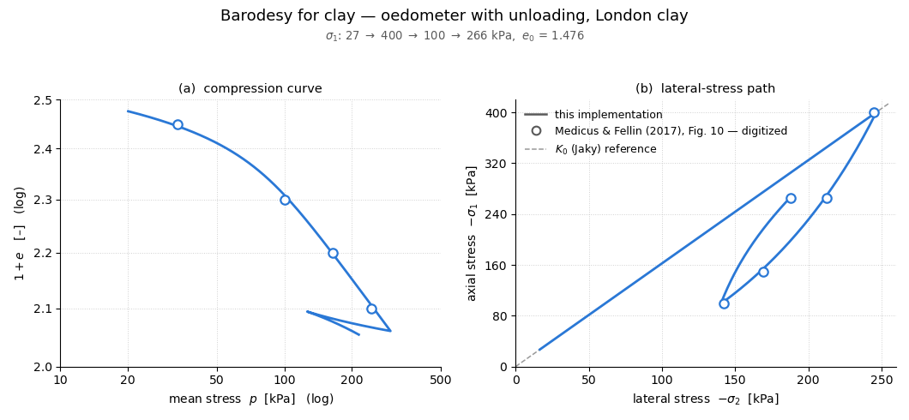
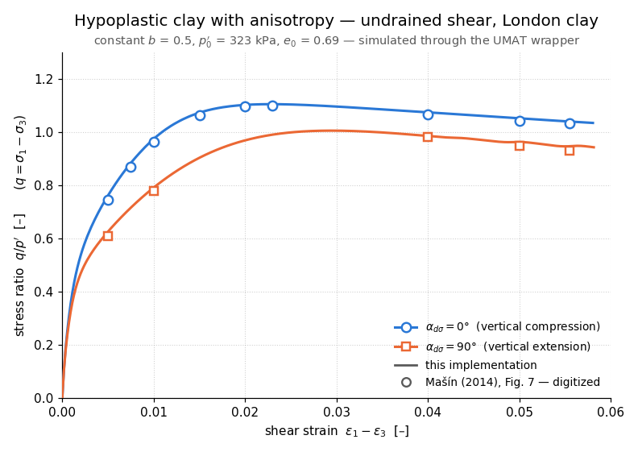

.. _UMAT:

UMAT Material
^^^^^^^^^^^^^

This command constructs a generic wrapper ``nDMaterial`` that drives an external constitutive subroutine written in the Abaqus UMAT format. The wrapper itself contains **no model-specific code**: the UMAT entry symbol, the material constants (``PROPS``) and the initial state-variable values (``STATEV``) are supplied through the material definition, so compatible user materials — including separately licensed ones — can be compiled separately and bound at run time. No UMAT constitutive models are bundled with this wrapper; users supply their own UMAT source or shared library (see `Obtaining and Compiling UMAT Models`_ below).

.. function:: nDMaterial UMAT $tag -symbol $sym -nprops $n -props $p1 ... $pn -nstatv $m <-statev $v1 ... $vm> <-initial_stress $s11 $s22 $s33 $s12 $s13 $s23> <-library $path> <-rho $rho> <-check_tangent $h>

.. csv-table::
   :header: "Argument", "Type", "Description"
   :widths: 12, 10, 40

   $tag, |integer|, unique material tag
   -symbol $sym, |string|, name of the UMAT entry subroutine (e.g. ``umat_mymodel``); both ``$sym`` and ``$sym_`` (gfortran trailing underscore) are tried
   -nprops $n, |integer|, number of material constants; must come before ``-props``
   -props $p1 ... $pn, |floatList|, the ``$n`` material constants passed to the UMAT as ``PROPS``
   -nstatv $m, |integer|, number of state variables (``NSTATV``); may be zero for stateless models (``-statev`` is then omitted); must come before ``-statev``
   -statev $v1 ... $vm, |floatList|, optional initial values of the ``$m`` state variables (default: all zero)
   -initial_stress $s11 ... $s23, |floatList|, optional initial stress; six components in **Abaqus order** s11 s22 s33 s12 s13 s23 (default: zero)
   -library $path, |string|, optional path to a shared library (``.so``) containing the UMAT; without it the symbol is looked up among the symbols compiled into OpenSees itself
   -rho $rho, |float|, optional mass density (default 0.0)
   -check_tangent $h, |float|, optional development diagnostic: compares ``DDSDDE`` against a central-difference approximation after every accepted evaluation and reports discrepancies; ``$h`` is the absolute perturbation applied to each engineering-strain component (see `Verifying a UMAT`_; never alters the analysis)

The wrapper calls the UMAT with the full Abaqus argument list and ``NTENS=6``, ``NDI=3``, ``NSHR=3`` (three-dimensional only: the material responds to ``getCopy`` requests of type ``ThreeDimensional``/``3D`` only). The OpenSees Voigt component order [11, 22, 33, 12, 23, 31] is mapped to the Abaqus order [11, 22, 33, 12, 13, 23] by swapping components 5 and 6 — on strain in, on stress out, and on both rows and columns of ``DDSDDE``. Both conventions are tension-positive with engineering shear strains, so no sign flips are involved.

State handling follows the committed/trial pattern expected by OpenSees solution algorithms: every ``setTrialStrain`` re-runs the UMAT from the **committed** stress/``STATEV`` snapshot with the total strain increment accumulated since the last commit, ``commitState`` copies trial to committed, and ``revertToLastCommit`` discards the trial state. Repeated equilibrium iterations therefore do not accumulate constitutive history from rejected trial states.

.. note::

   1. **The tangent is passed through unsymmetrized.** Many geomaterial UMATs (hypoplasticity, barodesy) return an unsymmetric ``DDSDDE``; use a solver that accepts unsymmetric matrices (e.g. ``system UmfPack`` or ``system FullGeneral``) with such models.

   2. **Step cutback (PNEWDT).** A returned ``PNEWDT < 1`` (the UMAT's request for a smaller increment) is translated into a failed material update: ``setTrialStrain`` returns -1. The multiplier itself is not propagated — step reduction and retry remain the responsibility of the analysis procedure driving the model, so combine with an adaptive analysis driver for robust nonlinear runs.

   3. **Characteristic length (CELENT).** The UMAT receives the characteristic length reported by its parent OpenSees element. Whether that measure suits a particular regularization remains model-dependent.

   4. **XIT.** A fatal error in the user material (the Abaqus ``XIT`` utility) fails the step instead of terminating the process.

   5. **Time.** In transient analyses ``DTIME`` follows the OpenSees domain time increment. In static analyses it follows the domain pseudo-time/load-factor increment, with a fallback value of 1.0 when no positive increment is available. Rate-independent models are unaffected either way; rate-dependent UMATs (e.g. visco-hypoplastic models) receive the OpenSees transient time increment.

   6. The material is usable in parallel object distribution provided the shared library is present at the same path on every process. Dynamic symbol binding on Windows is implemented but not yet exercised.

   7. **Runtime property updates.** Material constants can be changed during an analysis through the parameter API: ``prop$i`` addresses ``PROPS($i)`` (1-based), e.g. ``setParameter -val $v -ele $eleTag prop3``. Cached tangents are invalidated automatically; the new value takes effect from the next trial evaluation.

   Further implementation notes are documented in the source (``UmatMaterial.cpp``).

Typical use is with geomaterial models distributed in UMAT format — advanced sand and clay models, hypoplastic and bounding-surface formulations and the like — which can be used in OpenSees continuum elements without translating the constitutive code. In coupled u-p consolidation analyses the fluid phase (permeability, storage) is handled by the u-p elements themselves — the UMAT models the soil skeleton's effective-stress response only, so rate-independent UMATs do not require a separate pore-fluid constitutive implementation in the material wrapper.

.. _`Obtaining and Compiling UMAT Models`:

Obtaining and Compiling UMAT Models
"""""""""""""""""""""""""""""""""""

An established repository of geomaterial implementations in UMAT format is `soilmodels.com <https://soilmodels.com>`_, which hosts, among others, hypoplastic models for sand and clay, barodesy, and intergranular-strain extensions. Any compatible user-written UMAT, or compatible UMAT ported from an Abaqus workflow, is loaded in the same way: the wrapper only needs the compiled entry subroutine.

**Compiling a shared library (Linux example).** Compile the Fortran source into a position-independent shared library:

.. code-block:: bash

   gfortran -shared -fPIC -O2 -std=legacy -fallow-argument-mismatch \
            -finit-local-zero -o libmymodel.so umat_mymodel.f90

``-std=legacy`` and ``-fallow-argument-mismatch`` accommodate the fixed-form and mixed-interface style common in published UMATs; ``-finit-local-zero`` is included for legacy UMATs known to rely on zero-initialized local variables. Note on symbol naming: gfortran appends a trailing underscore to subroutine names (``umat_mymodel`` becomes ``umat_mymodel_`` in the library); the ``-symbol`` argument accepts either form. If a library is to contain several models, rename each model's entry subroutine to something unique (many published sources name the entry ``umat``, which collides when several are linked together).

**Running.** Point ``-library`` at the compiled library and supply ``-nprops``/``-props`` and ``-nstatv`` (and, where applicable, ``-statev``) according to the model's own documentation. For stress-dependent geomaterials pass ``-initial_stress``: many soil models are degenerate at zero stress, so initialize with a compressive stress state consistent with the in-situ conditions.

**Compile-in alternative.** Users building OpenSees from source can compile UMAT sources directly into the binary with the CMake cache variable ``OPS_UMAT_SOURCES`` (a semicolon-separated list of Fortran files); the entry symbols are then found without ``-library``.

**Licensing.** UMAT models carry their own licenses — many of those on soilmodels.com are GPL-licensed. Review the applicable model license before compiling, using, modifying, or redistributing the model or any combined binary.

.. _`Verifying a UMAT`:

Verifying a UMAT
""""""""""""""""

When bringing up a new or ported UMAT, the ``-check_tangent $h`` option provides a built-in consistency check: after every accepted constitutive evaluation the wrapper re-runs the UMAT at strains perturbed by :math:`\pm h` on each component — each positive and negative perturbation evaluated independently from the same committed constitutive snapshot, so the check does not disturb the analysis — and compares the resulting central-difference Jacobian against the ``DDSDDE`` the UMAT returned. ``$h`` is the absolute perturbation applied to each engineering-strain component. The checker reports the largest absolute and relative discrepancies when the relative discrepancy — normalized by the largest entry of either tangent — exceeds 10 %. This catches Voigt-ordering mistakes, engineering-shear convention errors and inconsistent Jacobians early, at the cost of twelve extra UMAT calls per evaluation — use it during model bring-up and single-element testing, not in production runs.

Interpret the report with the model class in mind: incrementally nonlinear formulations (hypoplasticity, barodesy) have direction-dependent stiffness, so finite differences straddling a strain reversal legitimately disagree with the returned operator. A large reported mismatch is a prompt to inspect, not proof of an error; the check never alters the computed response.

.. admonition:: Example — generic syntax

   A model ``umat_mymodel`` with 5 material constants and 8 state variables, compiled to ``libmymodel.so`` as above, initialized with an isotropic compressive stress of 100 kPa:

   1. **Tcl Code**

   .. code-block:: none

      nDMaterial UMAT 1 -symbol umat_mymodel \
          -nprops 5 -props 120.0 0.85 0.25 1.10 0.001 \
          -nstatv 8 \
          -initial_stress -100.0 -100.0 -100.0 0.0 0.0 0.0 \
          -library /home/user/lib/libmymodel.so

      # unsymmetric tangents: choose a general solver
      system UmfPack

   2. **Python Code**

   .. code-block:: python

      nDMaterial('UMAT', 1, '-symbol', 'umat_mymodel',
                 '-nprops', 5, '-props', 120.0, 0.85, 0.25, 1.10, 0.001,
                 '-nstatv', 8,
                 '-initial_stress', -100.0, -100.0, -100.0, 0.0, 0.0, 0.0,
                 '-library', '/home/user/lib/libmymodel.so')

      # unsymmetric tangents: choose a general solver
      system('UmfPack')

Worked Example: Hochstetten Sand (Hypoplasticity with Intergranular Strain)
"""""""""""""""""""""""""""""""""""""""""""""""""""""""""""""""""""""""""""

This complete example runs the workflow end to end with a real published model: the von Wolffersdorff (1996) hypoplastic sand model with the intergranular strain extension of Niemunis and Herle (1997), as distributed in UMAT format on `soilmodels.com <https://soilmodels.com>`_ (implementation by Tamagnini, Sellari, Mašín and von Wolffersdorff). A single brick element is compressed in a drained oedometer (zero lateral strain) starting from a 100 kPa isotropic stress state. For the full model formulation, parameter meanings and calibration guidance, refer to von Wolffersdorff (1996), Niemunis and Herle (1997), Herle and Gudehus (1999), and the model's page on soilmodels.com — this page documents only the wrapper.

**1. Compile the downloaded model.** The entry subroutine in the distributed source file (here saved as ``umat_hyposand.for``) is named ``umat``:

.. code-block:: bash

   gfortran -shared -fPIC -O2 -std=legacy -fallow-argument-mismatch \
            -finit-local-zero -o libhyposand.so umat_hyposand.for

**2. Material constants.** The model takes 16 ``PROPS``, in the order documented in the header of the source file. The values below are the Hochstetten sand calibration — the eight hypoplastic constants follow the calibration of Herle and Gudehus (1999), the five intergranular strain constants are as tabulated by Niemunis and Herle (1997):

.. csv-table::
   :header: "PROPS", "Symbol", "Value", "Meaning"
   :widths: 8, 12, 12, 45

   1, :math:`\varphi_c`, 33.0, critical state friction angle [deg]
   2, :math:`p_t`, 0.0, shift of mean stress due to cohesion [kPa]
   3, :math:`h_s`, 1.0e6, granular hardness [kPa]
   4, :math:`n`, 0.25, exponent of the compression law
   5, :math:`e_{d0}`, 0.55, minimum void ratio at zero stress
   6, :math:`e_{c0}`, 0.95, critical void ratio at zero stress
   7, :math:`e_{i0}`, 1.05, maximum void ratio at zero stress
   8, :math:`\alpha`, 0.25, pycnotropy exponent
   9, :math:`\beta`, 1.50, stiffness exponent
   10, :math:`m_R`, 5.0, stiffness multiplier after 180° strain-path reversal
   11, :math:`m_T`, 2.0, stiffness multiplier after 90° strain-path change
   12, :math:`R`, 1.0e-4, size of the elastic (intergranular strain) range
   13, :math:`\beta_r`, 0.5, intergranular strain evolution parameter
   14, :math:`\chi`, 6.0, intergranular strain interpolation exponent
   15, :math:`bulk_w`, 0.0, pore-fluid bulk modulus (0 = drained)
   16, :math:`e_0`, 0.70, initial void ratio

The model uses 13 state variables: ``STATEV(1-6)`` hold the intergranular strain tensor, ``STATEV(7)`` the current void ratio, ``STATEV(13)`` the suggested substep size. Only the void ratio needs seeding: pass ``-statev`` with :math:`e_0` in slot 7 and zeros elsewhere. For this hypoplastic model a physically meaningful compressive ``-initial_stress`` is required, because the constitutive formulation is degenerate at zero stress.

**3. Drained oedometer.** A 1 m³ ``stdBrick`` (units kN, m — stresses in kPa) with oedometric boundary conditions. Phase 1 applies the top load that balances the 100 kPa initial stress (an equilibrium check: settlement must be numerically zero). Phase 2 compresses the sample under displacement control to 0.5 % axial strain and reads the axial stress back from the base reactions; a final unload step shows the signature intergranular strain effect — a much stiffer response on strain-path reversal.

1. **Tcl Code**

.. code-block:: none

   model basic -ndm 3 -ndf 3

   node 1 0.0 0.0 0.0;  node 2 1.0 0.0 0.0;  node 3 1.0 1.0 0.0;  node 4 0.0 1.0 0.0
   node 5 0.0 0.0 1.0;  node 6 1.0 0.0 1.0;  node 7 1.0 1.0 1.0;  node 8 0.0 1.0 1.0

   set P0 100.0;   # initial isotropic stress [kPa], compression

   # Hochstetten sand: PROPS in the order of the UMAT source header
   nDMaterial UMAT 1 -symbol umat \
       -nprops 16 -props 33.0 0.0 1.0e6 0.25 0.55 0.95 1.05 0.25 1.50 \
                         5.0 2.0 1.0e-4 0.5 6.0 0.0 0.70 \
       -nstatv 13 -statev 0.0 0.0 0.0 0.0 0.0 0.0 0.70 0.0 0.0 0.0 0.0 0.0 0.0 \
       -initial_stress -$P0 -$P0 -$P0 0.0 0.0 0.0 \
       -library ./libhyposand.so

   element stdBrick 1 1 2 3 4 5 6 7 8 1

   # oedometer: no lateral strain, base fixed vertically, top face tied
   foreach n {1 2 3 4 5 6 7 8} { fix $n 1 1 0 }
   foreach n {1 2 3 4} { fix $n 0 0 1 }
   foreach n {6 7 8} { equalDOF 5 $n 3 }

   constraints Transformation
   numberer RCM
   system UmfPack;   # hypoplastic tangent is unsymmetric
   test NormDispIncr 1.0e-8 50
   algorithm Newton

   proc sigmaA {} {
       reactions
       set s 0.0
       foreach n {1 2 3 4} { set s [expr {$s + [nodeReaction $n 3]}] }
       return $s;   # compression positive (A = 1 m^2)
   }

   # phase 1: top load balancing the initial stress (equilibrium check)
   timeSeries Linear 1
   pattern Plain 1 1 { load 5 0.0 0.0 [expr {-$P0}] }
   integrator LoadControl 1.0
   analysis Static
   analyze 1
   puts "settlement under balancing load : [nodeDisp 5 3] m"
   loadConst -time 0.0

   # phase 2: displacement-driven compression to 0.5 % axial strain
   timeSeries Linear 2
   pattern Plain 2 2 { load 5 0.0 0.0 -1.0 }
   integrator DisplacementControl 5 3 -1.0e-4
   set sigPrev 0.0
   set sigA 0.0
   for {set i 1} {$i <= 50} {incr i} {
       if {[analyze 1] != 0} { error "step $i failed" }
       set sigPrev $sigA
       set sigA [sigmaA]
   }
   puts "axial strain  : [format %.2f [expr {-100.0 * [nodeDisp 5 3]}]] %"
   puts "axial stress  : [format %.1f $sigA] kPa (compression, started at $P0)"

   # one unload step: strain-path reversal is much stiffer (intergranular strain)
   set Eload [expr {($sigA - $sigPrev) / 1.0e-4}]
   integrator DisplacementControl 5 3 1.0e-4
   if {[analyze 1] != 0} { error "unload step failed" }
   set Eunload [expr {([sigmaA] - $sigA) / -1.0e-4}]
   puts "loading / unloading stiffness : [format %.0f $Eload] / [format %.0f $Eunload] kPa (ratio [format %.1f [expr {$Eunload / $Eload}]])"

2. **Python Code**

.. code-block:: python

   # Hochstetten sand: PROPS in the order of the UMAT source header
   props = [33.0, 0.0, 1.0e6, 0.25, 0.55, 0.95, 1.05, 0.25, 1.50,
            5.0, 2.0, 1.0e-4, 0.5, 6.0, 0.0, 0.70]
   statev = [0.0] * 13
   statev[6] = 0.70          # STATEV(7) = initial void ratio e0

   P0 = 100.0                # initial isotropic stress [kPa], compression

   model('basic', '-ndm', 3, '-ndf', 3)
   for tag, (x, y, z) in enumerate([(0, 0, 0), (1, 0, 0), (1, 1, 0), (0, 1, 0),
                                    (0, 0, 1), (1, 0, 1), (1, 1, 1), (0, 1, 1)],
                                   start=1):
       node(tag, float(x), float(y), float(z))

   nDMaterial('UMAT', 1, '-symbol', 'umat',
              '-nprops', 16, '-props', *props,
              '-nstatv', 13, '-statev', *statev,
              '-initial_stress', -P0, -P0, -P0, 0.0, 0.0, 0.0,
              '-library', './libhyposand.so')
   element('stdBrick', 1, 1, 2, 3, 4, 5, 6, 7, 8, 1)

   # oedometer: no lateral strain, base fixed vertically, top face tied
   for tag in range(1, 9):
       fix(tag, 1, 1, 0)
   for tag in (1, 2, 3, 4):
       fix(tag, 0, 0, 1)
   for tied in (6, 7, 8):
       equalDOF(5, tied, 3)

   constraints('Transformation')
   numberer('RCM')
   system('UmfPack')         # hypoplastic tangent is unsymmetric
   test('NormDispIncr', 1.0e-8, 50)
   algorithm('Newton')

   # phase 1: top load balancing the initial stress (equilibrium check)
   timeSeries('Linear', 1)
   pattern('Plain', 1, 1)
   load(5, 0.0, 0.0, -P0)    # total on the tied top face (A = 1 m^2)
   integrator('LoadControl', 1.0)
   analysis('Static')
   analyze(1)
   print('settlement under balancing load :', nodeDisp(5, 3), 'm')
   loadConst('-time', 0.0)

   # phase 2: displacement-driven compression to 0.5 % axial strain
   timeSeries('Linear', 2)
   pattern('Plain', 2, 2)
   load(5, 0.0, 0.0, -1.0)   # reference load for DisplacementControl
   integrator('DisplacementControl', 5, 3, -1.0e-4)
   sig_hist = []
   for step in range(50):
       if analyze(1) != 0:
           raise RuntimeError(f'step {step + 1} failed')
       reactions()
       sig_hist.append(sum(nodeReaction(n, 3) for n in (1, 2, 3, 4)))

   sig_a = sig_hist[-1]      # compression positive (A = 1 m^2)
   eps_a = -nodeDisp(5, 3)
   print(f'axial strain  : {eps_a * 100:.2f} %')
   print(f'axial stress  : {sig_a:.1f} kPa (compression, started at {P0:.0f})')

   # one unload step: strain-path reversal is much stiffer (intergranular strain)
   E_load = (sig_hist[-1] - sig_hist[-2]) / 1.0e-4
   integrator('DisplacementControl', 5, 3, 1.0e-4)
   if analyze(1) != 0:
       raise RuntimeError('unload step failed')
   reactions()
   sig_u = sum(nodeReaction(n, 3) for n in (1, 2, 3, 4))
   E_unload = (sig_u - sig_a) / -1.0e-4
   print(f'loading / unloading stiffness : {E_load:.0f} / {E_unload:.0f} kPa '
         f'(ratio {E_unload / E_load:.1f})')

**4. Expected results.** Running the script prints:

.. code-block:: none

   settlement under balancing load : -1.99e-19 m
   axial strain  : 0.50 %
   axial stress  : 294.3 kPa (compression, started at 100)
   loading / unloading stiffness : 29080 / 316559 kPa (ratio 10.9)

The balancing load produces a settlement at machine precision — the ``-initial_stress`` state is in exact equilibrium. Oedometric compression stiffens the response as the mean stress grows (barotropy), reaching 294.3 kPa axial stress at 0.5 % strain, and the first unloading increment is about 11 times stiffer than the preceding loading increment, demonstrating the expected intergranular-strain response on strain-path reversal. These numbers were produced with exactly this script (Python version, Linux, the ``gfortran`` compile line above); the model integrates with an adaptive substepping tolerance of :math:`10^{-3}`, so small last-digit differences across platforms are normal.

Validation Against Published Model Results
""""""""""""""""""""""""""""""""""""""""""

The figures below compare single-element simulations — soilmodels.com UMATs driven through ``nDMaterial UMAT`` on a single ``stdBrick``, exactly as in the worked example above — against result figures digitized from the model authors' own papers. Checks for two model families are shown; the comparisons presented here agree with the digitized published results to within approximately 2 %, which is within the estimated digitization uncertainty for these figures (up to about 3 % on the steepest branches, where the strain-axis reading error dominates). These figures demonstrate the wrapper, not the models — the authoritative documentation of each model lives with its authors.

**Barodesy for clay** (Medicus and Fellin, 2017) — drained triaxial compression and extension of Weald clay, and an oedometric load–unload–reload cycle on London clay. For the full model formulation, parameter meanings and calibration guidance, refer to Medicus and Fellin (2017), the barodesy introduction of Kolymbas (2015), and the model's page on `soilmodels.com <https://soilmodels.com>`_.

   Barodesy for clay: drained triaxial compression and extension of Weald clay (normally consolidated and overconsolidated samples), simulated with this wrapper vs data digitized from Fig. 8 of Medicus and Fellin (2017).

   Barodesy for clay: oedometric loading, unloading and reloading of London clay, simulated with this wrapper vs data digitized from Fig. 10 of Medicus and Fellin (2017) — compression curve (left) and lateral-stress path :math:`\sigma_2`–:math:`\sigma_1` (right).

**Hypoplastic clay with small-strain stiffness anisotropy** (Mašín, 2014) — undrained shear of London clay at constant intermediate-stress ratio :math:`b = 0.5`, with the major principal stress vertical (:math:`\alpha_{d\sigma} = 0°`) and horizontal (:math:`\alpha_{d\sigma} = 90°`): the directional-stiffness effect the model was built for. For the full model formulation, parameter meanings and calibration guidance, refer to Mašín (2013, 2014) and the model's page on `soilmodels.com <https://soilmodels.com>`_.

   Hypoplastic clay with anisotropy: undrained shear of London clay at constant :math:`b = 0.5` (:math:`\alpha_{d\sigma}` = 0° and 90°); data digitized from Fig. 7 of Mašín (2014); simulated through the UMAT wrapper.

.. admonition:: References

   #. Dassault Systèmes. "UMAT: User subroutine to define a material's mechanical behavior." Abaqus User Subroutines Reference Guide.

   #. Gudehus, G., et al. (2008). "The soilmodels.info project." International Journal for Numerical and Analytical Methods in Geomechanics, 32(12), 1571-1572. See https://soilmodels.com.

   #. von Wolffersdorff, P.-A. (1996). "A hypoplastic relation for granular materials with a predefined limit state surface." Mechanics of Cohesive-Frictional Materials, 1(3), 251-271.

   #. Niemunis, A., and Herle, I. (1997). "Hypoplastic model for cohesionless soils with elastic strain range." Mechanics of Cohesive-Frictional Materials, 2(4), 279-299.

   #. Herle, I., and Gudehus, G. (1999). "Determination of parameters of a hypoplastic constitutive model from properties of grain assemblies." Mechanics of Cohesive-Frictional Materials, 4(5), 461-486.

   #. Medicus, G., and Fellin, W. (2017). "An improved version of barodesy for clay." Acta Geotechnica, 12(2), 365-376.

   #. Kolymbas, D. (2015). "Introduction to barodesy." Géotechnique, 65(1), 52-65.

   #. Mašín, D. (2013). "Clay hypoplasticity with explicitly defined asymptotic states." Acta Geotechnica, 8(5), 481-496.

   #. Mašín, D. (2014). "Clay hypoplasticity model with explicit asymptotic state boundary surface formulation and very small strain stiffness anisotropy." In: Numerical Methods in Geotechnical Engineering — Proceedings of the 8th European Conference (NUMGE 2014), Delft, The Netherlands.

Developed by Fernando Sarabia, Ph.D., P.E.
